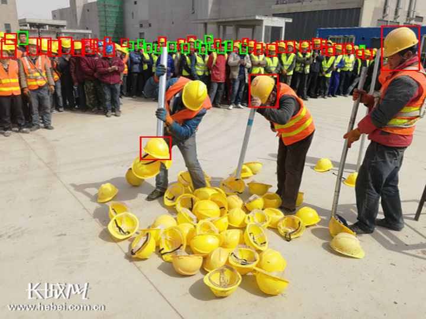

Real Time Helmet Detection
==
This is pytorch implementation of helmet detector based on [CenterNet](https://arxiv.org/abs/1904.07850).

I used the [SafetyHelmetWearing-Dataset(SHWD)](https://github.com/njvisionpower/Safety-Helmet-Wearing-Dataset) to detect helmet or person.

I will continue to update the entries to be filled in [TODO](https://github.com/tyui592/Real_Time_Helmet_Detection/wiki/TODO) for research.

[](https://colab.research.google.com/drive/1-zz9z9_irTNtvsHBxVefsyT-lV0isBbJ?usp=sharing)

## Requirements
- [imgaug](https://github.com/aleju/imgaug) (v0.4.0)
- [torch](https://pytorch.org/) (v1.6.0)
- [torchvision](https://pytorch.org/) (v0.7.0)
- [torchsummary](https://github.com/sksq96/pytorch-summary)
- [requirements.txt](./requirements.txt)

## Features
- [Automatic Mixed Precision(AMP)](https://pytorch.org/docs/stable/amp.html)
- [Distributed Data Parallel(DDP)](https://pytorch.org/docs/stable/generated/torch.nn.parallel.DistributedDataParallel.html#torch.nn.parallel.DistributedDataParallel)
- [TorchScript](https://pytorch.org/docs/stable/jit.html#mixing-tracing-and-scripting)

## Usage
[SafetyHelmetWearing-Dataset(SHWD)](https://github.com/njvisionpower/Safety-Helmet-Wearing-Dataset) is need to train detector [[Download](https://drive.google.com/file/d/1qWm7rrwvjAWs1slymbrLaCf7Q-wnGLEX/view)].

### Example Scripts

#### Train
```bash
$ python main.py --train-flag --gpu-no 0 --data ./DATA/VOC2028/ --save-path ./WEIGHTS/ --amp
```

#### Test
```bash
$ python main.py --gpu-no 0  --model-load ./WEIGHTS/check_point.pth --data ./DATA/VOC2028 --imsize 512 --save-path ./WEIGHTS/results --batch-size 8
```

#### Measure mAP
```bash
$ cd mAP
mAP$ python main.py -na -np --dr ../WEIGHTS/results/txt/
```

#### Demo
```bash
$ python evaluate.py --gpu-no 0 --model-load ./WEIGHTS/check_point.pth --data ./imgs/000019.jpg --imsize 512 --save-path ./imgs/000019 --topk 100 --conf-th 0.2 --nms-th 0.2 --fontsize 0
```

## Results
| Input | Output |
| --- | --- |
|  |  |

**Performance**

| Helmet (AP) | Person (AP) | mAP |
| --- | --- | --- |
| 88.16 % | 88.71 % | 88.43 % |

The model trained by above Example Script.
The performance may be improved by increasing model size (ex, `--num-stack`, `--increase-ch`, ...) or searching hyperparameters (ex, `--hm-weight`, `--lr`, ...) more carefully.

Loading A Pytorch Model in C++
--

1. Create TorchScript Code of Detector
```bash
$ python export.py --model-load ./WEIGHTS/check_point.pth --nms-th 0.5 --topk 100
```

2. [Build App](https://github.com/tyui592/PytorchToCpp)


3. Run App (Speed: 100FPS @(512x512, 1080 Ti))
```bash
PytorchToCpp/build$ ./main -m ../../jit_traced_model_gpu.pth -i ../../imgs/000019.jpg
```
